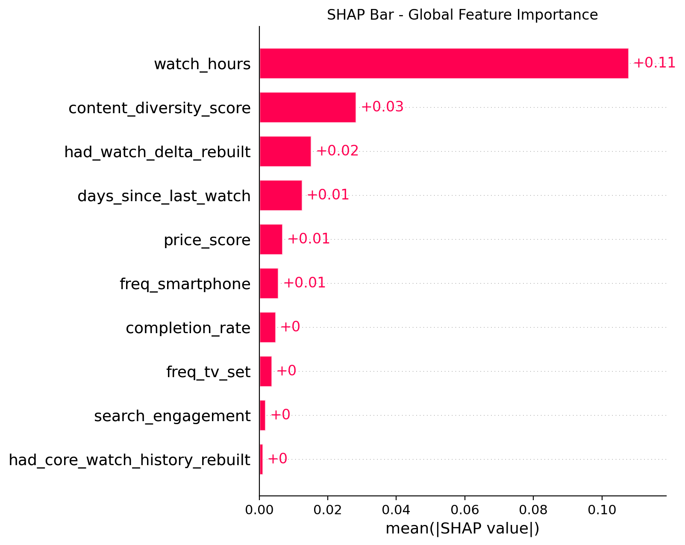
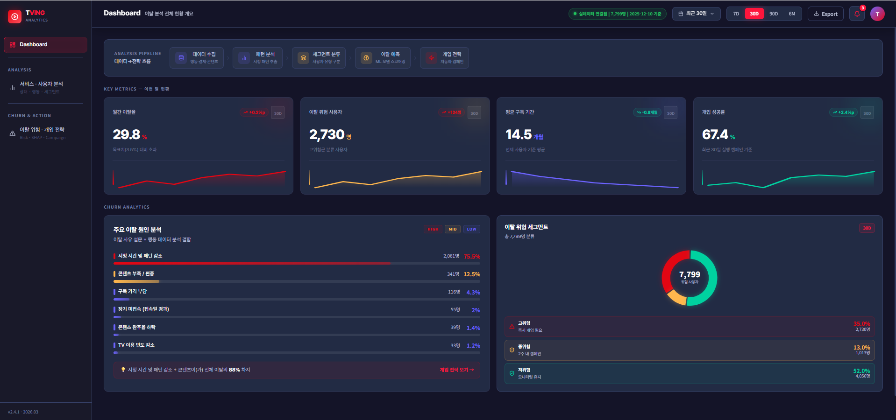

# TVING Churn Prediction & Retention Strategy

OTT 사용자 행동 데이터를 기반으로 **이탈 위험을 예측**하고,  
단순 점수 산출을 넘어 **개입 가능한 시점과 실행 전략까지 연결**한 데이터 기반 프로젝트입니다.

> **한 줄 요약**  
> “누가 떠날지”를 맞히는 데서 끝나지 않고, **언제 개입해야 하는지**까지 판단할 수 있는 구조를 설계했습니다.

> **Note**  
> 본 레포는 팀 프로젝트 결과를 바탕으로 개인 포트폴리오 용도에 맞게 재구성한 버전입니다.  
> 대표 발표자료와 README는 개인 기여, 문제 정의, 해석 관점을 중심으로 다시 정리했으며,  
> 조별 최종 발표자료는 참고용 보조 자료로 함께 제공합니다.  
> 프로젝트의 핵심 결과와 역할 분담은 실제 팀 산출물 기준을 유지했습니다.

---

## 1. Project Overview

기존 churn 분석은 사용자의 이탈을 **사후적으로 확인**하는 데 머무르기 쉽습니다.  
이 프로젝트는 문제를 단순 예측 자체가 아니라, **행동이 꺾이기 시작하는 시점을 조기에 포착하고 실무 액션으로 연결하는 것**으로 재정의했습니다.

이를 위해 사용자 행동 로그를 기반으로 시계열 예측 구조를 설계하고,  
예측 결과를 SHAP 기반으로 해석해 **운영·마케팅 관점에서 활용 가능한 대시보드**까지 구현했습니다.

### Key Objectives
- 사용자 행동 기반 **churn risk 예측**
- 운영 우선순위를 위한 **risk band 구간화**
- 사용자 특성 반영 **persona type 분류**
- **SHAP 기반 예측 결과 해석**
- 분석 결과를 실제 액션으로 연결하는 **dashboard 구성**

---

## 2. Why This Project?

OTT 서비스에서는 사용자의 이탈을 대체로 **떠난 뒤에야 확인**하게 되는 경우가 많습니다.  
하지만 실무적으로 더 중요한 것은 이탈 여부 자체보다, **개입 가능한 시점을 먼저 포착하는 것**입니다.

저는 이 문제의식을 바탕으로 다음과 같은 질문에서 출발했습니다.

- 사용자의 이탈 위험은 언제부터 신호가 나타나는가?
- 단순 KPI 확인이 아니라, **행동 변화의 전조 신호**를 포착할 수 있는가?
- 예측 결과를 실제 운영 액션으로 연결할 수 있는가?

이 프로젝트는 이러한 질문에 답하기 위해,  
**사후 판별 중심 접근에서 선제 개입 중심 접근으로 문제를 재구성**한 작업입니다.

---

## 3. My Contribution

팀 프로젝트에서 저는 **팀장**으로서 다음 역할을 맡았습니다.

- 전체 분석 방향 및 문제 정의 수립
- 데이터 구조 및 변수 설계 기준 정리
- EDA를 통한 핵심 패턴 도출 및 해석 근거 정리
- 프로젝트 스토리라인 및 발표 구조 설계
- 예측 결과를 실무 활용 관점으로 연결하는 서사 구성

### Especially Focused On
- 문제를 단순 churn 예측이 아니라 **개입 타이밍 판단 문제**로 재정의
- `snapshot / feature / label` 구조를 분리해 **데이터 누수 방지**
- 모델 성능 수치보다 **설명 가능성과 실행 가능성**이 보이는 방향으로 정리

---

## 4. Team Members

- **조가영**: 전체 분석 방향 수립, 데이터 설계 기준 정리, 프로젝트 스토리라인 구성, EDA 및 해석 근거 정리
- **송미영**: 발표용 시각화 정리 및 PPT 디자인
- **이세미**: 대시보드 시각화, Figma 설계 및 화면 고도화
- **이재혁**: 로그 집계, 모델 실행, 성능 및 수치 검증

---

## 5. Data & Analysis Design

이 프로젝트는 시계열 예측 정합성을 확보하기 위해 다음 구조를 사용했습니다.

- **Snapshot Cadence**: 7일
- **Feature Window**: 과거 28일
- **Label Window**: 미래 14일

### Why this structure?
- **7일 Snapshot**: 주간 반복 모니터링이 가능한 기준 시점
- **28일 Feature Window**: 최근 이용 패턴을 충분히 반영할 수 있는 행동 집계 구간
- **14일 Label Window**: 실제 비활성 여부를 판단할 수 있는 최소 기준 구간

즉,  
**최근 행동 패턴을 설명하는 구간**과  
**이탈 여부를 판정하는 구간**을 분리해  
예측 구조의 현실성과 해석 가능성을 높였습니다.

---

## 6. Data Structure

본 프로젝트의 데이터는 아래 흐름으로 구성됩니다.

- 사용자 / 구독 / 콘텐츠 기본 정보
- 시청(`watch`), 검색(`search`), 추천 반응(`recommend`) 로그
- 사용자 단위 요약 마트(`summary`)
- 시점 기준 피처 스냅샷(`snapshot`)
- 미래 행동 기반 이탈 라벨(`label`)

### Core Tables
- `user_enriched_summary`
- `user_feature_snapshot`
- `churn_label`

이 구조를 통해  
**원천 로그 → 사용자 단위 피처 → 시점 기반 라벨 → 모델링/해석/대시보드**로 이어지는 일관된 분석 파이프라인을 구축했습니다.

---

## 7. Feature Engineering

피처 엔지니어링은 단순 집계보다 **행동 변화와 위험 신호를 설명 가능하게 반영하는 것**에 초점을 두었습니다.

### Main Feature Groups
- **활동량 / 최근성**: 최근 시청 여부, 시청 시간, 마지막 활동 시점
- **탐색 행동**: 검색 빈도, 검색 후 반응, 추천 반응
- **행동 변화**: 최근 시청 감소, 탐색 패턴 변화, 반응성 저하
- **이용 맥락**: 기기 사용 패턴, 콘텐츠 다양성, 가격 민감도
- **완주/몰입도**: 완주율, 연속 시청, 특정 콘텐츠 집중도

### Derived Outputs
- **risk_band**: churn 위험도 구간
- **persona_type**: 사용자 성향 분류

---

## 8. Exploratory Data Analysis (EDA)

EDA는 raw 로그를 단순 요약하는 수준이 아니라,  
최종 churn mart 기준에서 **user-level 행동 패턴을 해석**하는 방향으로 수행했습니다.

### Main Analysis Axes
- 활동량
- 최근성
- 몰입도
- 탐색 행동
- 추천 반응
- 콘텐츠 소비 패턴
- 기기 사용 패턴
- 행동 변화

이 과정을 통해  
예측에 사용할 변수와 실제로 해석 가능한 행동 신호를 정리했습니다.

---

## 9. Modeling

모델링은 주간 snapshot panel 기반으로 진행했습니다.

### Pipeline
1. Snapshot 생성
2. Feature 구성
3. Label 생성
4. 학습/검증 분리
5. 모델 학습
6. 성능 평가
7. 대시보드용 결과 저장

### Model
- **AutoGluon Tabular**
- 최종 활용 모델: **LightGBM**

### Why LightGBM?
- 상위 위험군 선별 효율이 높았음
- 실무 활용에 적합한 속도와 해석 연결성이 좋았음
- 대시보드 연계 및 결과 저장 구조에 유리했음

---

## 10. SHAP-based Interpretation

예측 결과를 실무에서 활용하려면,  
단순 점수보다 **왜 위험한지 설명할 수 있어야 한다**고 판단했습니다.

그래서 SHAP을 활용해 다음을 확인했습니다.

- 전역 중요 변수(Global Importance)
- 변수 영향 방향성
- 개별 사용자 단위 위험 요인
- 위험 신호와 실행 전략 간 연결 가능성

### Example Signals
- 최근 시청량 감소
- 콘텐츠 다양성 저하
- 검색 후 미시청 패턴
- 추천 반응 저하
- 휴면 신호 강화

---

## 11. Dashboard

대시보드는 예측 결과를 **운영 관점에서 바로 활용할 수 있도록** 설계했습니다.

### Main Components
- churn risk distribution
- KPI row
- 주요 이탈 원인
- 사용자 상세 분석
- intervention queue
- 실행 전략 연결 화면

### Dashboard Goal
단순히 위험 사용자를 보여주는 것이 아니라,

**위험 사용자 식별 → 원인 해석 → 액션 제안**

까지 이어지는 흐름을 제공하는 것을 목표로 했습니다.

---

## 12. Results

### Key Results
- **7일 Snapshot / 28일 Feature / 14일 Label** 기반의 안정적 예측 구조 설계
- churn risk, risk band, persona type을 결합한 **다층 사용자 해석 체계 구축**
- SHAP 기반으로 위험 신호를 설명 가능한 형태로 정리
- 대시보드까지 연결해 **실행 가능한 분석 결과**로 전환

### Practical Meaning
이 프로젝트는 단순 예측 모델이 아니라,  
Product 팀이 다음 질문에 답할 수 있도록 돕는 구조를 목표로 했습니다.

- **누구에게 (Target)**
- **무엇을 (Action)**
- **언제 (When)**

개입할 것인가?

---

## 13. Tech Stack

- **Language**: Python, TypeScript
- **Data Analysis**: pandas, numpy
- **Modeling**: AutoGluon, LightGBM
- **Evaluation**: scikit-learn
- **Interpretation**: SHAP
- **Visualization**: matplotlib
- **Dashboard**: Figma, TSX
- **Version Control**: GitHub

---

## 14. Project Structure

```bash
tving-churn-retention/
├── assets/
├── dashboard/
│   ├── guidelines/
│   ├── src/
│   ├── ATTRIBUTIONS.md
│   ├── index.html
│   ├── package.json
│   ├── package-lock.json
│   ├── postcss.config.mjs
│   ├── vite.config.ts
│   └── README.md
├── data/
│   ├── content_catalog_2025.csv
│   ├── synthetic_churn_final.csv
│   ├── synthetic_recommend_2025.csv
│   ├── synthetic_search_2025.csv
│   └── synthetic_watch_2025.csv
├── docs/
│   ├── 8_데이터구조_변수정의서.xlsx
│   ├── 10_피처엔지니어링_변수정의서.xlsx
│   └── 11_EDA_분석_변수정의서.xlsx
├── notebooks/
│   ├── SHAP_핵심코드.ipynb
│   ├── 모델링_핵심코드.ipynb
│   └── 최종코드.ipynb
├── output/
│   ├── dashboard_main.png
│   ├── final_erd.png
│   ├── final_erd_ppt.png
│   ├── shap_bar.png
│   └── shap_beeswarm.png
├── report/
└── README.md
```
---

## 15. Lessons Learned

이 프로젝트를 통해 가장 크게 배운 점은  
**예측 성능 자체보다 데이터 구조와 라벨 정의, 그리고 실행 연결성이 더 중요할 수 있다**는 사실이었습니다.

초기에는 전형적인 churn 예측 문제로 접근했지만,  
실제로는 다음이 더 중요했습니다.

- 어떤 기준 시점을 둘 것인가
- 어떤 행동 구간을 feature로 볼 것인가
- 어떤 기간을 이탈 판단 기준으로 둘 것인가
- 예측 결과를 실제 개입 전략으로 연결할 수 있는가

즉, 좋은 모델보다 먼저 필요한 것은  
**좋은 문제 정의와 좋은 데이터 구조**라는 점을 확인했습니다.

---

## 16. Presentation & Materials

- [Portfolio Deck (개인 포트폴리오용 발표자료)](report/tving_churn_portfolio_deck.pdf)
- [Team Final Deck (조별 최종 발표자료)](report/tving_churn_team_final_deck.pdf)

---

## 17. Preview

### ERD


### SHAP Global Importance


### Dashboard
